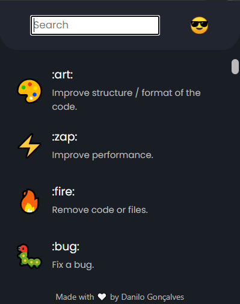

## 🚀 Gitmoji Browser Extension

Chrome and Firefox extension to easily **search** and **copy** gitmojis.

<p align="center">
  
</p>

### 📦️ Installation

Extension not yet available on Chrome Web Store.

However, it can be installed following the steps below:


1. Clone repository
    ```sh
      git clone https://github.com/GoncalvesDanilo/gitmoji-extension.git
    ```

2. Go to [Chrome Extensions](chrome://extensions)

3. Turn on developer mode

4. Click on `Load Unpacked`

5. Select the folder `Extension` of the cloned repository
### ✨ Usage

- Shortcut: `Shift+Alt+G`
- Searching accepts both **name** and **description** of Gitmojis.
- Clicking the **name**, **description** or **image** of a Gitmoji will copy it to clipboard.
